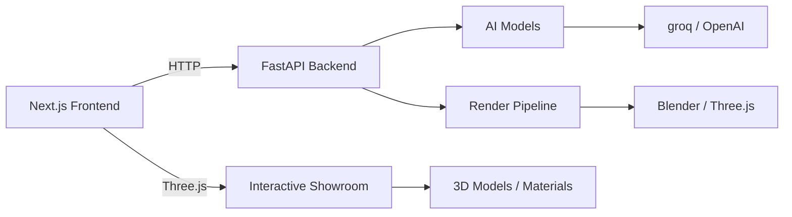

<div align="center">


# 🚀 AetherForge

**Digital studio car design — redefining automotive through AI & realtime 3D**

[](https://nextjs.org/)
[](https://threejs.org/)
[](https://fastapi.tiangolo.com/)
[](https://tailwindcss.com/)

---

## 🎯 What We Build

Interactive 3D hypercar showroom & AI-powered concept studio — where design meets engineering.

| Cinematic Showroom | AI Concept Generation | Engineering Lab |
|-------------------|----------------------|-----------------|
| Realtime 3D viewer | Prompt → 3D preview | Aerodynamics simulation |
| Orbit/Zoom/Pan controls | Style transfer options | Drag coefficient estimation |
| Material picker | Export to OBJ/FBX | Weight distribution calculator |

---

## 🏗 Architecture



### Stack Overview

| Layer | Technology | Purpose |
|-------|------------|---------|
| **Frontend** | Next.js 16 + React 19 + TypeScript | App router, SSR, SEO |
| **3D Engine** | @react-three/fiber + @react-three/drei | Realtime Three.js in React |
| **Styling** | Tailwind CSS 4 | Utility-first design system |
| **Animations** | GSAP | Cinematic transitions, parallax |
| **Backend** | FastAPI (Python 3.12) | REST API, AI orchestration |
| **AI** | Groq / OpenAI | Text generation, concept assist |
| **Deploy** | Vercel + Render | Frontend + backend hosting |
| **Future DB** | PostgreSQL + Redis + Object Storage | User projects, cache, assets |

---

## ✨ Features

- **Cinematic intro** — GSAP-powered opening sequence
- **Interactive 3D showroom** — Orbit controls, 360° rotation, material switching
- **Project collection** — Grid layout with image galleries
- **Design lab workflow** — Step-by-step concept creation process
- **Commission system** — Contact form with backend integration
- **AI-assisted generation** — Text-to-concept with prompt engineering

---

## 🚀 Getting Started

### Prerequisites

- Node.js ≥ 18
- Python ≥ 3.12
- npm

### Development

```bash
# Clone and install
git clone https://github.com/ballales1984-wq/AetherForge.git
cd AetherForge

# Frontend
npm install
npm run dev   # → http://localhost:3000

# Backend (separate terminal)
cd apps/api
python -m venv venv
venv\Scripts\Activate.ps1   # Windows PowerShell
# venv/bin/activate        # macOS/Linux
pip install -r requirements.txt
uvicorn main:app --reload  # → http://localhost:8000
```

### Environment Variables

Frontend (.env.local):

```env
NEXT_PUBLIC_API_URL=http://localhost:8000
GROQ_API_KEY=your_key_here
```

Backend (apps/api/.env):

```env
GROQ_API_KEY=your_key_here
```

---

## ☁️ Deployment

### Frontend — Vercel

Automatic deploys from `main` branch.

Required env vars:
- `NEXT_PUBLIC_API_URL` — https://aetherforge-qanw.onrender.com
- `GROQ_API_KEY`

🔗 [View Live](https://aetherforge-qanw.vercel.app)

### Backend — Render

Deployed via `render.yaml` (FastAPI worker).

🔗 [API Endpoint](https://aetherforge-qanw.onrender.com)

| Endpoint | Method | Description |
|----------|--------|-------------|
| `/health` | GET | Health check |
| `/commissions` | POST | Submit commission request |
| `/ai/generate` | POST | AI text generation |

---

## 📸 Gallery

### Hero Showcase


### Engineering Lab


---

## 🗺 Roadmap

### Version 1.0 — Portfolio Cinematic (Current)
- [x] Next.js + FastAPI setup
- [x] Three.js showroom
- [x] GSAP animations
- [x] Deploy on Vercel/Render
- [ ] Custom domain (aetherforge.studio)

### Version 2.0 — AI Concept Studio
- [ ] User authentication
- [ ] Project save/load
- [ ] Prompt → 3D preview
- [ ] Style transfer engine
- [ ] Multi-model rendering

### Version 3.0 — Engineering Platform
- [ ] Aerodynamics calculator
- [ ] Weight distribution simulator
- [ ] Material database
- [ ] Suspension geometry tools
- [ ] Performance telemetry

---

## 🌐 Live Demo

- **Frontend:** https://aetherforge-qanw.vercel.app
- **Backend API:** https://aetherforge-qanw.onrender.com
- **Health Check:** https://aetherforge-qanw.onrender.com/health

---

## 📁 Project Structure

```text
AetherForge/
├── src/
│   ├── app/              # Next.js app router (pages)
│   ├── components/       # React components + 3D showroom
│   ├── data/            # Static assets, configs
│   └── lib/             # Utilities, hooks
├── apps/
│   └── api/             # FastAPI backend
│       ├── routes/      # API endpoints
│       ├── models/      # Pydantic models
│       └── services/    # Business logic
├── public/              # Static files (images, models)
├── vercel.json          # Vercel config
├── render.yaml           # Render deployment
├── tailwind.config.js    # Tailwind configuration
├── package.json          # Frontend dependencies
├── requirements.txt      # Python dependencies
└── README.md            # This file
```

---

## 🤝 Contributing

This is a solo project, but ideas and feedback are welcome.

If you'd like to collaborate on:
- 3D modeling & materials
- AI pipeline optimization
- UI/UX design systems
- Automotive engineering calculations

Open an issue or reach out.

---

## 📄 License

Apache 2.0 — free for personal and commercial use.

---

## 🏷 Tags

`nextjs` `threejs` `fastapi` `tailwind` `gsap` `react-three-fiber` `hypercar` `3d-showroom` `automotive-design` `ai-studio` `concept-car` `realtime-rendering` `webgl` `shader`

---

<div align="center">

**Built with precision, designed for speed.**

*Follow the journey → [@ballales1984](https://github.com/ballales1984-wq)*

</div>

</div>
